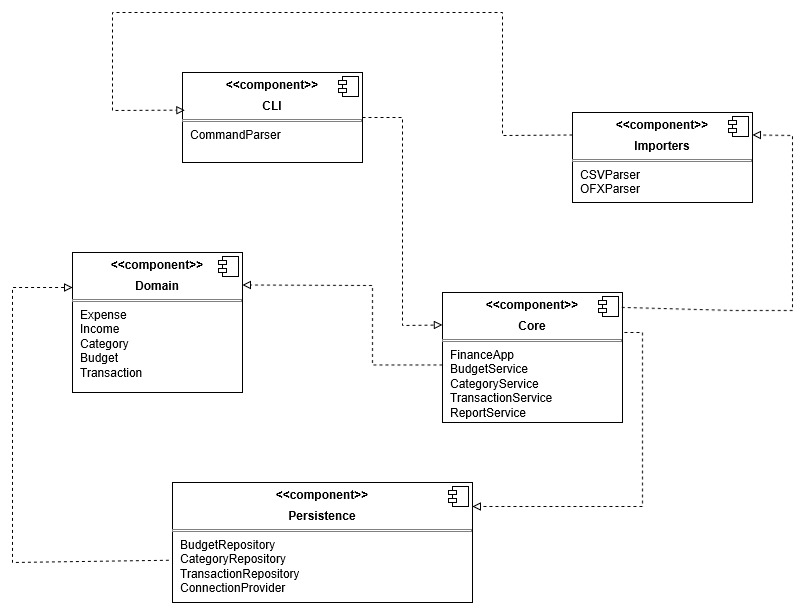

# Personal Finance CLI Manager

A command-line tool for managing personal finances, built in **Rust**. It supports adding transactions, 
storing data in SQLite, and is designed to be easily extensible.

## Features

- Import transactions from CSV and OFX files *(planned)* 
- Manually add **income** and **expenses**  
- Categorize transactions automatically *(planned)*
- Set budgets per categories and get alarms *(planned)*  
- Generate reports such as monthly spending, category breakdown *(planned)*  
- Search and filter transactions

## Architecture Overview

The project follows a layered architecture, as can be seen in the
full architecture diagram:



### 🔹 Domain  
This component contains entities and rules:
- `Transaction`
- `Income`
- `Expense`
- `Category`
- `Budget`

### 🔹 Core  
This component contains application logic and use cases:
- `FinanceApp`
- `TransactionService`
- `CategoryService`
- `BudgetService`
- `ReportService`

### 🔹 Persistence  
Data storage and SQLite implementations:
- `TransactionRepository`
- `BudgetRepository`
- `CategoryRepository`
- `ConnectionProvider`

### 🔹 CLI  
User interface which, for now, contains the following functionalities:
- `add-income`
- `add-expense`
- (more commands coming soon)

---

## Installation & Usage

### Clone the repository

```sh
git clone https://github.com/Bogdans2001/Project_ATAD.git
```

### Build and run

```sh
cargo run -- <command>
```

### Example usage

```sh
cargo run -- add-expense --amount 50 --category-id 2 --date 2025-01-02 --description "Groceries"
```
