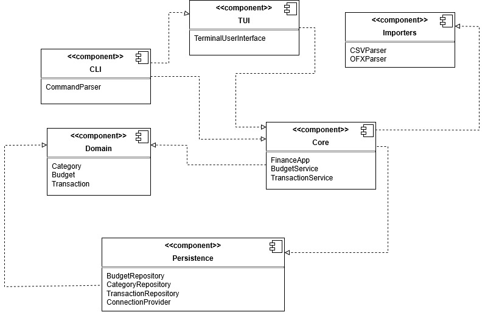
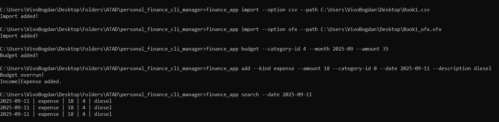
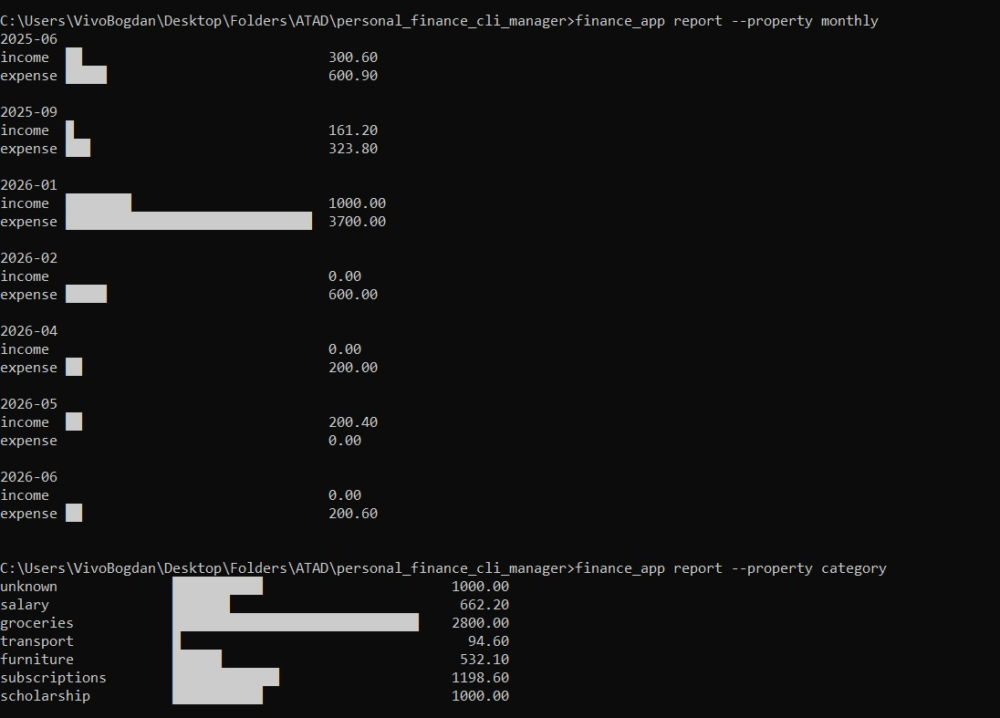
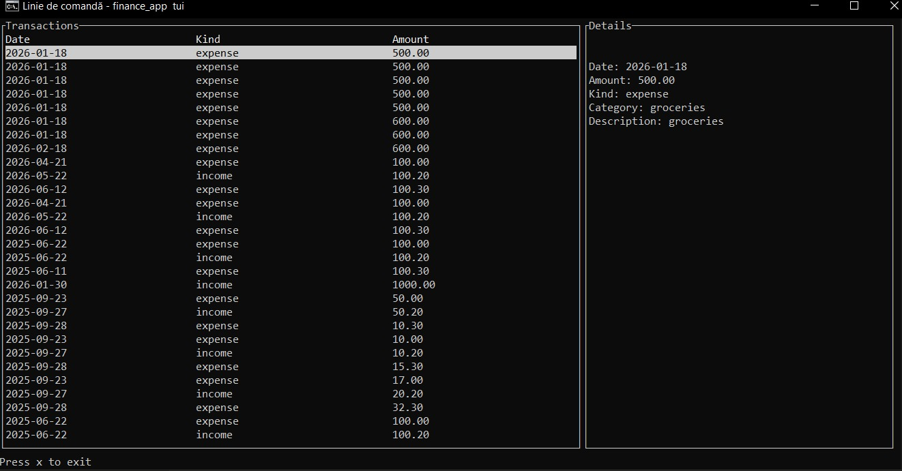

# Personal Finance CLI Manager

A command-line tool for managing personal finances, built in **Rust**. It supports adding transactions, 
storing data in SQLite, and is designed to be easily extensible.

## Features

- Import transactions from CSV and OFX files 
- Manually add **income** and **expenses**  
- Categorize transactions automatically
- Set budgets per categories and get alarms  
- Generate reports such as monthly spending, category breakdown  
- Search and filter transactions
- Interactive TUI (Terminal UI) for browsing

## Architecture Overview

The project follows a layered architecture, as can be seen in the
full architecture diagram:



### 🔹 Domain
This component contains entities and rules:
- `Transaction`
- `Category`
- `Budget`

### 🔹 Core
This component contains application logic and use cases:
- `FinanceApp`
- `TransactionService`
- `BudgetService`

### 🔹 Persistence
Data storage and SQLite implementations:
- `TransactionRepository`
- `BudgetRepository`
- `ConnectionProvider`

### 🔹 Importers
Parsers for banking input files:
- `CSVParser`
- `OFXParser`

### 🔹 TUI  
Terminal User Interface which displays:
- `list of transactions`
- `transaction details`

### 🔹 CLI  
Command Parser which contains the following functionalities:
- `add`
- `search`
- `report`
- `budget`
- `import`
- `tui`

---

## Installation & Usage

### Clone the repository

```sh
git clone https://github.com/Bogdans2001/Project_ATAD.git
```

### Build and run

```sh
cargo build --release
```

After the build is successful, the path to `\target\release` has to be added to Path environment variable. Otherwise, `cargo run` command can be used.

### Example usage

```sh
finance_app import --option csv --path C:\Users\VivoBogdan\Desktop\Book1.csv
finance_app import --option ofx --path C:\Users\VivoBogdan\Desktop\Book1_ofx.ofx
finance_app budget --category-id 4 --month 2025-09 --amount 35
finance_app add --kind expense --amount 18 --category-id 0 --date 2025-09-11 --description diesel
finance_app search --date 2025-09-11
finance_app report --property monthly
finance_app report --property category
finance_app tui
```

For input file format, please check the examples from [/docs/example_inputs](https://github.com/Bogdans2001/Project_ATAD/tree/main/docs/example_inputs).

### Expected outputs







### Future work

- Improving the transaction categorization mechanism
- Adding more options to the TUI
- Introducing new commands for CLI